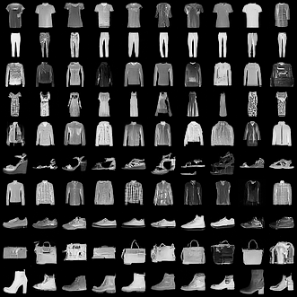
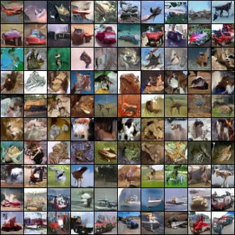
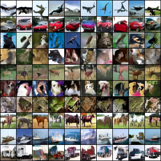
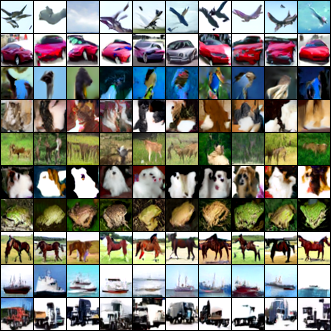
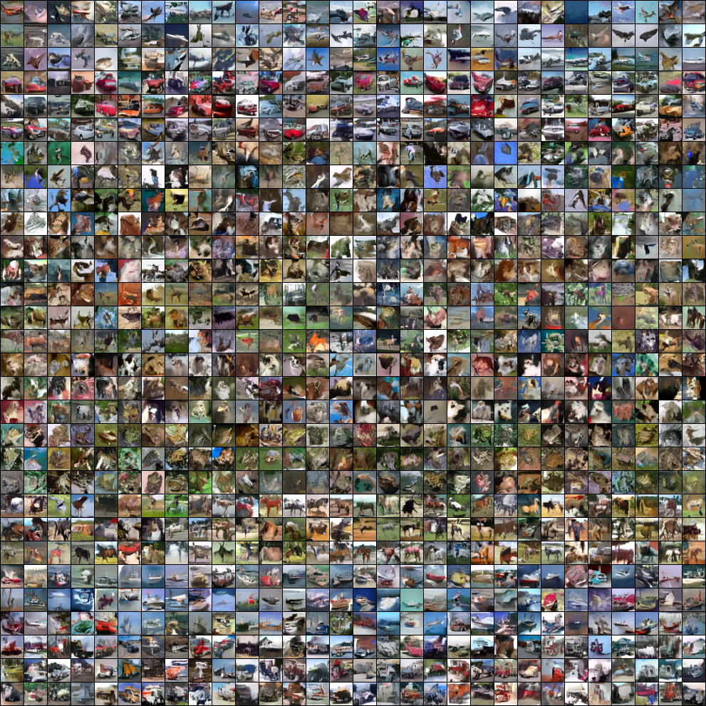
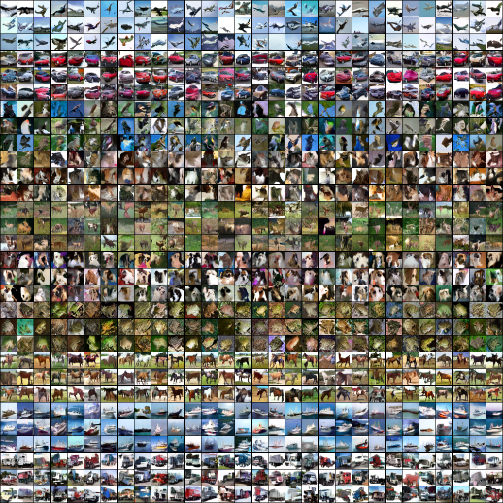
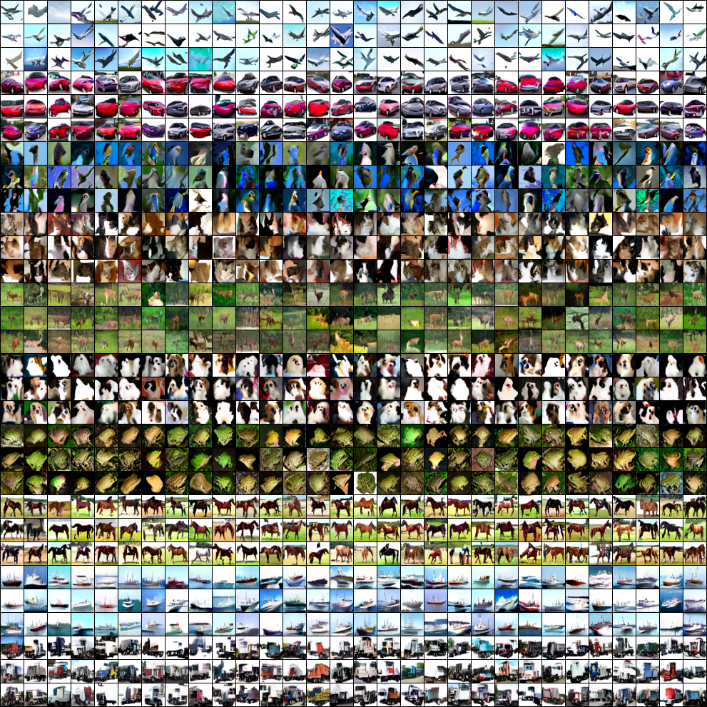

# Diffusion
Deep Learning Project on Diffusion Models for Image Generation based on [Elucidating the Design Space of Diffusion-Based Generative Models](https://arxiv.org/abs/2206.00364)'s paper by Karras et al.

|  |  |  |  |
|:--:| :--:|:--:| :--:|
|  |  |  |  |
| *FashionMNIST cfg.scale=1, Euler method* | *CIFAR-10 cfg.scale=1, Euler method* | *CIFAR-10 cfg.scale=2.5, Euler method* | *CIFAR-10 cfg.scale=5, Euler method* |

|  |  |
|:--:| :--:|
|  |  |
| *CIFAR-10 cfg.scale=2.5, Euler method* | *CIFAR-10 cfg.scale=5, Euler method* |

# How To Use?

## Training

```bash
python src/trainer.py
```


## Sampling

- Unconditional generation

```bash
python src/sampler.py
```

- Classifier-Free Guidance (CFG) for a single class

```bash
python src/sampler.py common.sampling.label=<class-id> common.sampling.cfg_scale=1
```

- Classifier-Free Guidance (CFG) for all classes

```bash
python src/sampler_all.py common.sampling.cfg_scale=1
```


# Tests

- No code coverage report

```
python -m unittest discover -s tests/
```

- If want code coverage:

```
python -m coverage run -m unittest discover -s tests/
```

```
python -m coverage report --omit=*python3*
```

# Notes

## Classifier-Free Guidance

- Our **Classifier-Free Guidance** (CFG) scale $\alpha$ corresponds to using $\nabla_x \log p_{t, \alpha}(x|c) = (1-\alpha) \nabla_x \log p_t(x) + \alpha \nabla_x \log p_t(x|c)$ instead of the unconditional score function $\nabla_x \log p_t(x)$ of noisy marginal distributions in the original probability flow ODE $dx = -\dot{\sigma}(t) \sigma(t) \nabla_x \log p_t(x)$.
- [Classifier-Free Diffusion Guidance](https://arxiv.org/abs/2207.12598) paper uses, assuming we can directly replace a noise by a score function, $\nabla_x \log p_{t, \alpha}(x|c) = -\omega \nabla_x \log p_t(x) + (1+\omega) \nabla_x \log p_t(x|c)$ with $\omega=\alpha-1 > 0$. Therefore our CFG scale $\alpha$ should be greater than $1$.
- $\nabla_x \log p_{t, \alpha}(x|c)$ can also be rewritten as $\nabla_x \log p_t(x) + \alpha (\nabla_x \log p_t(x|c) - \nabla_x \log p_t(x))$
- The CFG scale $\alpha$ deforms the distribution and reduces diversity. As we can see from the generated CIFAR-10 pictures, a high CFG scale can cause saturated colors so one may opt for class-dependent scales.
- Our CFG scale is kept unchanged in our sampling methods.

# Credits

The computations were performed at University of Geneva using Baobab/Yggdrasil HPC service

- https://github.com/pytorch/pytorch
- https://github.com/crowsonkb/k-diffusion/tree/master
- https://wandb.ai
- https://github.com/zalandoresearch/fashion-mnist
- https://www.cs.toronto.edu/~kriz/cifar.html
- https://mmlab.ie.cuhk.edu.hk/projects/CelebA.html
