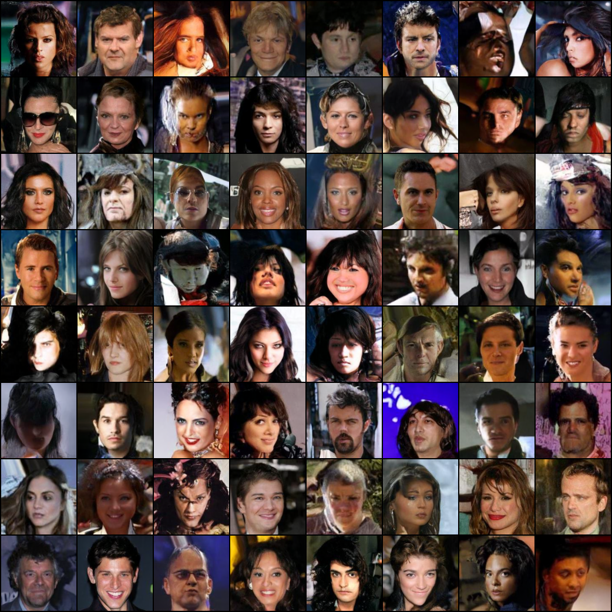
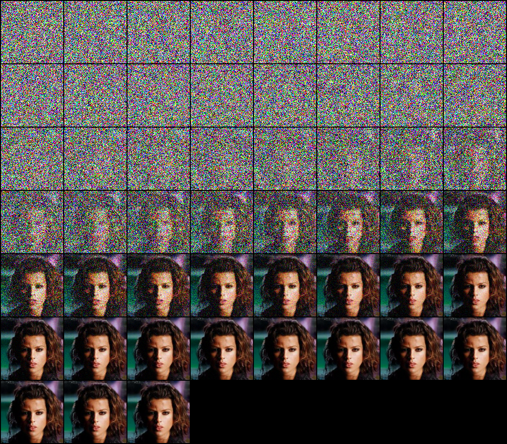
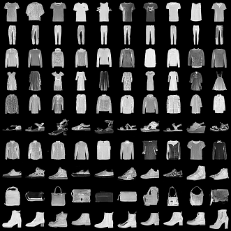
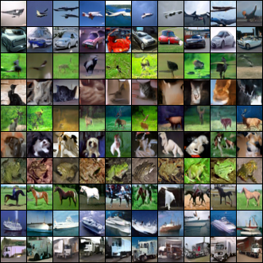
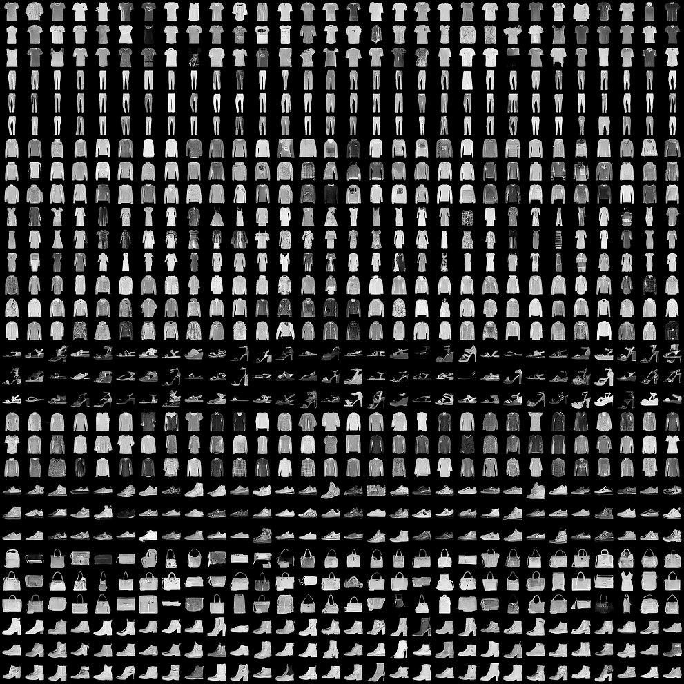
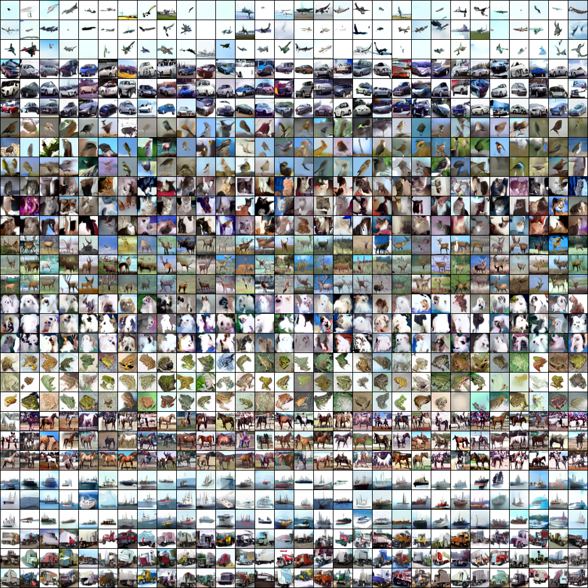
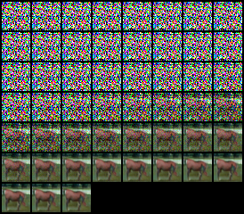
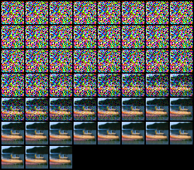

# Diffusion
Deep Learning Project on Diffusion Models for Image Generation based on [Elucidating the Design Space of Diffusion-Based Generative Models](https://arxiv.org/abs/2206.00364)'s paper by Karras et al.

## Some generated images

### Unconditional

**CelebA epoch 125, 50 stochastic heun method steps, 35M parameters U-Net model:**

|  |  |
|:--:| :--:|
| *Randomly generated faces* | *An iterative denoising process* |

### Conditional generation with Classifier-Free Guidance

**FashionMNIST and CIFAR-10, 50 Euler method steps, 5M parameters U-Net model:**

|  |  |
|:--:| :--:|
|  |  |
| *FashionMNIST cfg.scale=1, 100 epochs* | *CIFAR-10 cfg.scale=2.5, 200 epochs* |

**Randomly generated horse and ship (cfg.scale=2.5, 50 Euler method steps):**


|  |  |
|:--:| :--:|


## Installation

- Install PyTorch

```
pip3 install torch torchvision torchaudio --index-url https://download.pytorch.org/whl/cu118
```

- And other dependencies:
```
pip3 install -r requirements.txt
```

- You may need to download the CelebA dataset from their website: https://mmlab.ie.cuhk.edu.hk/projects/CelebA.html

We developed the code for Python 3.11.3 with torch==2.1.1 and torchvision==0.16.1. Using a different Python version might cause problems. The computations were performed at the University of Geneva using the Baobab/Yggdrasil HPC service (Titan RTX GPUs).

The sampling not only works on Titan RTX GPUs but also on a GTX 1070 using less than 4000 MiB of VRAM (FashionMNIST and CIFAR-10) or less than 5000 MiB (CelebA tiny) for the Euler and Heun sampling method.

---
<details>
  <summary>Using a virtual environment</summary>

- Ubuntu:
  - Setting up the virtual environment
    ```bash
    sudo add-apt-repository ppa:deadsnakes/ppa
    sudo apt install python3.11
    sudo apt install python3.11-venv
    python3.11 -m venv ~/.myvenv
    source ~/.myvenv/bin/activate
    
    ~/.myvenv/bin/pip3 install --upgrade pip
    ~/.myvenv/bin/pip3 install -r requirements.txt
    ```

- Yggdrasil or Baobab HPC service
  - Setting up the virtual environment
    ```
    module load GCCcore/12.3.0 virtualenv/20.23.1
    module load Python/3.11.3
    module load code-server/4.17.1
    python3 -m venv $HOME/.myvenv
    source $HOME/.myvenv/bin/activate
    
    pip install wheel
    pip install --upgrade pip
    pip install -r requirements.txt
    ```
  - Where `~/.bashrc` should contain
    ```
    alias pip=$HOME/.myvenv/bin/pip3
    alias activate='source $HOME/.myvenv/bin/activate'
    
    module load GCCcore/12.3.0 virtualenv/20.23.1
    module load Python/3.11.3
    module load code-server/4.17.1
    python3 -m venv $HOME/.myvenv
    activate
    ```
    and then `source $HOME/.bashrc`

</details>

## Configuration

Our Python scripts look by default for the configuration file `./config/config.yaml`.

- If a trained model is specified in the `defaults` section of `./config/config.yaml`, the trained model configuration will override the `./config/config.yaml`. More details later. 

- You can specify a particular `.yaml` file located under the `./config` directory. To do so, you can append `--config-name <config-name>` right after the Python filename when launching Python scripts via the CLI. `<config-name>` is your config name without the yaml extension.

### Trained models

```yaml
defaults:
  - _self_
  # Add one of the following right after to use a trained model
  # - /cifar10/cond@_here_
  # - /cifar10/cond_ablation_attention@_here_
  # - /cifar10/uncond@_here_

  # - /fashionmnist/cond@_here_
  # - /fashionmnist/cond_ablation_attention@_here_
  # - /fashionmnist/uncond@_here_

  # - /celeba/uncond_big@_here_
  # - /celeba/uncond_small@_here_
  # - /celeba/uncond_tiny@_here_
  # - /celeba/uncond_tiny_ablation_attention@_here_
```

You can directly use the FashionMNIST and CIFAR-10 checkpoints.

For CelebA, you can download the checkpoints from [this Google Drive](https://drive.google.com/drive/folders/1FXN5McvvpWZG-5pzj7ii7smdrs7Pcvqx?usp=sharing) and place them under the correct directory specified by the configuration files in `./config/celeba`.


## Training

If you want to train a model from scratch, please ensure the checkpoint path doesn't point to an existing checkpoint. Otherwise, training will resume.

```bash
python src/trainer.py
```

## Sampling

- Unconditional generation

```bash
python src/sampler.py
```

- Conditional generation with Classifier-Free Guidance (CFG) for a single class

```bash
python src/sampler.py common.sampling.label=<class-id> common.sampling.cfg_scale=<cfg-scale>
```

- Classifier-Free Guidance (CFG) for all classes

```bash
python src/sample_all_cond.py common.sampling.cfg_scale=<cfg-scale>
```

This command also ignores any specified `common.sampling.label`.

## FID computation

The following command computes the Fréchet Inception Distance using [Clean-FID](https://github.com/GaParmar/clean-fid).

```bash
python src/fid.py common.sampling.cfg_scale=<cfg-scale>
```

This command also ignores any specified `common.sampling.label`.

If `conditional=True` and `info.num_classes` > 0 (or not None), our code will compute the FID based on conditionally generated samples with uniformly sampled classes. Therefore, you can change `conditional` in `src/fid.py` to either `True` or `False` for conditional or unconditional FID.

## More arguments
- **Training:** You can deactivate weights and biases logs by adding `wandb.mode=disabled`.

- **Sampling:**
    - You can change the sampling method by adding `common.sampling.method=<sampling-method>` where `<sampling-method>` can either be `euler`, `heun` or `stochastic_heun`. If not specified, the default is the method from the configuration file (e.g. `euler`).
    - You can change the number of sampling steps by adding `common.sampling.num_steps=<num-steps>` where `<num-step>` is a positive integer. If not specified, the default is the number of steps from the configuration file (e.g. $50$ sampling steps). The number of sampling steps $\neq$ of function evaluations (NFE) since you can choose the Heun method that doubles the NFE.

- Refer to [Hydra](https://hydra.cc/docs/intro/) for more information.

---

# Results

See `./results/README.md`.

# TODO list

- Reduce memory footprint (mostly in training)
- Decouple sampling and training procedures (incl. the initializations).
- Nearest neighbors in Inception V3 feature space.
- Report the effect of U-Net encoder-decoder skip connections ablation
- Analyze the effect of a different number of heads as we go in lower resolution latent representations
- Track an EMA model and maybe use pixel unshuffle/shuffle
- Re-train everything with the same dataset splits. Training and validation sets are never the same across models due to the `random_split`!
- Recompute FIDs.

# Remarks

Note: if you specify `num_workers` > 0 in the Dataloader and get a warning like `UserWarning: This DataLoader will create 2 worker processes in total. Our suggested max number of worker in current system is 1, which is smaller than what this DataLoader is going to create`, you need to make sure that you have access to enough cpu cores. For instance in Unige Baobab/Yggdrasil HPC service, I have to specify `#SBATCH --cpus-per-task 4` in my Slurm "sbatch" script.

# Credits

The computations were performed at the University of Geneva using the Baobab/Yggdrasil HPC service

- https://github.com/pytorch/pytorch
- https://github.com/crowsonkb/k-diffusion/tree/master
- https://github.com/GaParmar/clean-fid
- https://wandb.ai
- https://github.com/zalandoresearch/fashion-mnist
- https://www.cs.toronto.edu/~kriz/cifar.html
- https://mmlab.ie.cuhk.edu.hk/projects/CelebA.html
