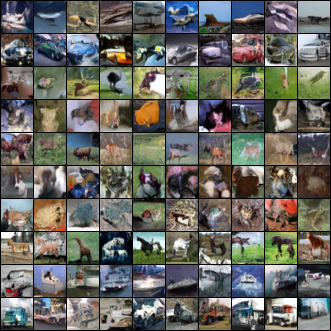

# Diffusion
Deep Learning Project on Diffusion Models for Image Generation based on [Elucidating the Design Space of Diffusion-Based Generative Models](https://arxiv.org/abs/2206.00364)'s paper by Karras et al.

## Generated samples

### Unconditional

**CelebA epoch 124, stochastic heun, 33M parameters U-Net model:**

|  |  |
|:--:| :--:|
| *Randomly generated faces* | *An iterative denoising process* |

### Conditional generation with Classifier-Free Guidance

**FashionMNIST and CIFAR-10, 50 Euler method steps, 5M parameters U-Net model:**

|  |  |
|:--:| :--:|
|  |  |
| *FashionMNIST cfg.scale=1, 100 epochs* | *CIFAR-10 cfg.scale=2.5, 200 epochs* |

**Randomly generated horse and ship (cfg.scale=2.5, 50 Euler method steps):**


|  |  |
|:--:| :--:|


# How To Use?

## Training

If you want to train a model from scratch, please make sure to delete `checkpoints/checkpoint.pth`, otherwise training will resume.

```bash
python src/trainer.py
```

Note: if you specify `num_workers` > 0 in the Dataloader and get a warning like `UserWarning: This DataLoader will create 2 worker processes in total. Our suggested max number of worker in current system is 1, which is smaller than what this DataLoader is going to create`, you need to make sure that you have access to enough cpu cores. For instance in Unige Baobab/Yggdrasil HPC service, I have to specify `#SBATCH --cpus-per-task 4` in my Slurm "sbatch" script.

## Sampling

- Unconditional generation

```bash
python src/sampler.py
```

- Conditional generation with Classifier-Free Guidance (CFG) for a single class

```bash
python src/sampler.py common.sampling.label=<class-id> common.sampling.cfg_scale=<cfg-scale>
```

- Classifier-Free Guidance (CFG) for all classes

```bash
python src/sampler_all.py common.sampling.cfg_scale=1
```

You can change the sampling method by adding `common.sampling.method=<sampling-method>` where `<sampling-method>` can be either `euler`, `heun` or `stochastic_heun`.

# Tests (Work in Progress)

- No code coverage report

```
python -m unittest discover -s tests/
```

- If want code coverage:

```
python -m coverage run -m unittest discover -s tests/
```

```
python -m coverage report --omit=*python3*
```

# Notes and brief discussion

## Practical

- Bigger network for more capacity. Going from 2M to 33M parameters (or more): randomly positioned eyes (and more than $2$) to recognizable faces (probably thanks to the Multi-head self-attention layers and bigger receptive fields!)
- Trade-off between model architecture and batch size for higher resolution images due to VRAM limits.
- We have to place the Multi-head self-attention layers in lower spatial resolution due to the quadratic complexity in attention. A spatial resolution $32^2=32 \times 32$ or $16^2 = 16 \times 16$ is intuitively enough to capture the long-range contextual information/dependencies and costs way less than a spatial resolution of $128^2$. On the other hand convolution layers, at both high and low spatial resolution, fix "local" inconsistencies (up to the receptive field size).
- Ablation of Multi-head self-attention only slightly affect the visual quality probably due to big enough receptive fields.
- TODO: Search the effect of different number of heads as we go in lower resolution latent representations
- TODO: train model with fixes + add EMA and gradient clipping and maybe pixel unshuffle/shuffle

## Effect of Classifier-Free Guidance

In the following, we **qualitatively** discuss the behavior of Classifier-Free Guidance (CFG) on CIFAR-10 with $50$ Euler method steps. We omit FashionMNIST since CFG barely affects its generated samples.

|  |  |  |  |
|:--:|:--:| :--:| :--:|
|  |  |  |  |
| *cfg.scale=1* | *cfg.scale=2.5* | *cfg.scale=5* | *cfg.scale=7* |

- Our **Classifier-Free Guidance** (CFG) scale $\alpha$ corresponds to using $\nabla_x \log p_{t, \alpha}(x|c) = (1-\alpha) \nabla_x \log p_t(x) + \alpha \nabla_x \log p_t(x|c)$ instead of the unconditional score function $\nabla_x \log p_t(x)$ of noisy marginal distributions in the original probability flow ODE $dx = -\dot{\sigma}(t) \sigma(t) \nabla_x \log p_t(x)dt$.
- [Classifier-Free Diffusion Guidance](https://arxiv.org/abs/2207.12598) paper uses, assuming we can directly replace a noise by a score function, $\nabla_x \log p_{t, \alpha}(x|c) = -\omega \nabla_x \log p_t(x) + (1+\omega) \nabla_x \log p_t(x|c)$ with $\omega=\alpha-1 > 0$. Therefore our CFG scale $\alpha$ should be greater than $1$.
- $\nabla_x \log p_{t, \alpha}(x|c)$ can also be rewritten as $\nabla_x \log p_t(x) + \alpha (\nabla_x \log p_t(x|c) - \nabla_x \log p_t(x))$
- The CFG scale $\alpha$ deforms the distribution and reduces diversity but can help "separate" classes. One should only tweak that scale if one doesn't want to exactly sample for the class-conditional distribution!
- As we can see from the generated CIFAR-10 pictures, a high CFG scale can cause saturated colors while a low CFG scale can lead to visually poor samples. Therefore, one may opt for class and dataset dependent scales.
- Our CFG scale is not adaptive in our sampling methods.

## Effect of self-attention

In the following, we **qualitatively** and sometimes **quantitatively** discuss the effect of self-attention on CIFAR-10 and FashionMNIST with $50$ Euler method steps. Note that the self-attention ablation also reduces the number of parameters, the capacity of the model.

### CIFAR-10
- First row: with self-attention at each resolution level
- Second row: without self-attention

|  |  |  |  |
|:--:|:--:| :--:| :--:|
|  |  |  |  |
| *cfg.scale=1* | *cfg.scale=2.5* | *cfg.scale=5* | *cfg.scale=7* |


# Credits

The computations were performed at University of Geneva using Baobab/Yggdrasil HPC service

- https://github.com/pytorch/pytorch
- https://github.com/crowsonkb/k-diffusion/tree/master
- https://wandb.ai
- https://github.com/zalandoresearch/fashion-mnist
- https://www.cs.toronto.edu/~kriz/cifar.html
- https://mmlab.ie.cuhk.edu.hk/projects/CelebA.html
