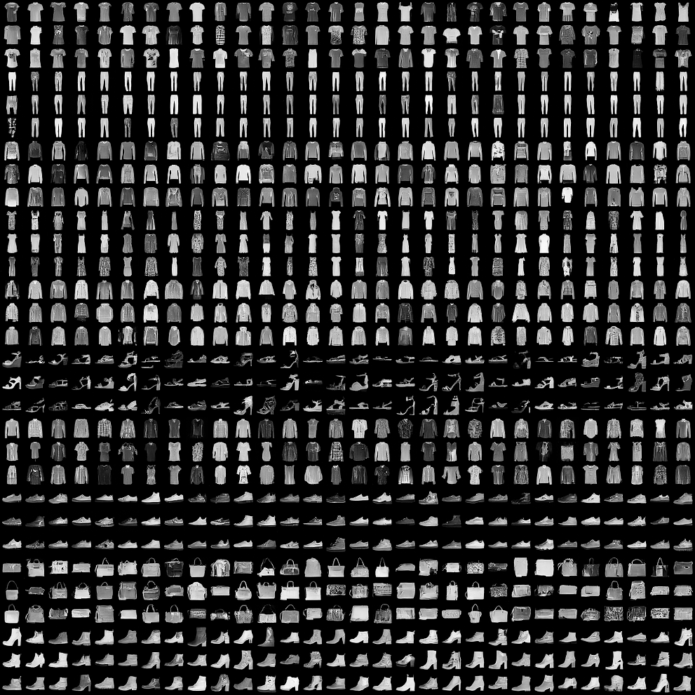

# Diffusion
Deep Learning Project on Diffusion Models for Image Generation

|  |  |
|:--:| :--:|
| *FashionMNIST cfg.scale=1* | *CIFAR-10 cfg.scale=1* |

# How To Use?

## Training

```bash
python src/trainer.py
```


## Sampling

- Unconditional generation

```bash
python src/sampler.py
```

- Classifier-Free Guidance (CFG)

Example
```bash
python src/sampler.py common.sampling.label=7 common.sampling.cfg_scale=1
```

# Tests

- No code coverage report

```
python -m unittest discover -s tests/
```

- If want code coverage:

```
python -m coverage run -m unittest discover -s tests/
```

```
python -m coverage report --omit=*python3*
```
