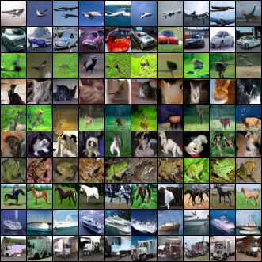
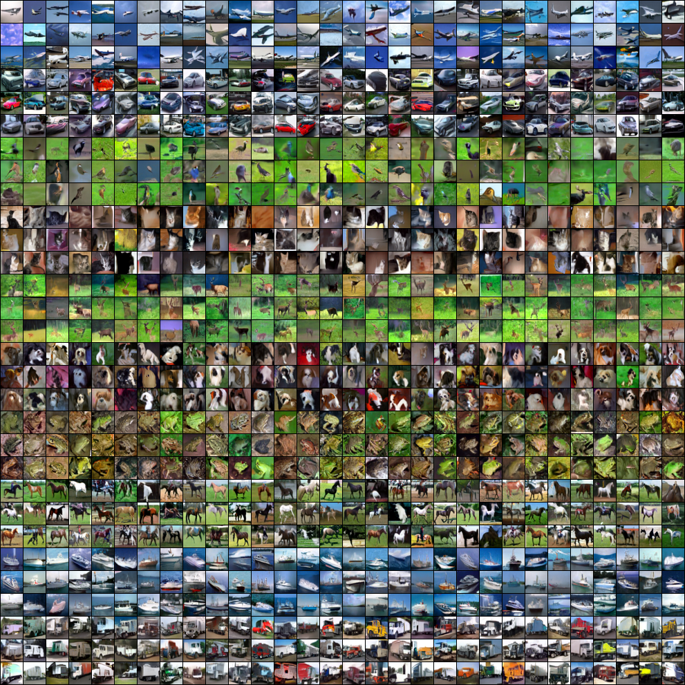

# Results and discussion

You can explore the rest of our generated samples in `./images`.

## Important remark(s)
- Models are not currently trained and evaluated on the same train and validation sets due to `random_split`. However, FIDs are computed on the same train and validation sets. Therefore, one shouldn't give conclusions based on them (where we write a "*").
- However, the test sets are the same across models.
- We compute each FID score reported below with 50k generated images (from the last epoch) and a reference set: either train, val or test sets (transformed/pre-processed images).
- Unless stated differently, the images are generated with $50$ Euler method steps.

## Quantitative FID results

The lower the FID, the better it should be.

### FashionMNIST
- **Class-conditional FID, cfg.scale 1:**

    |                    | Train*  | Val*    | Test        |
    |--------------------|---------|---------|-------------|
    | w/ self-attention  | 9.1676  | 10.5069 | **10.2580** |
    | w/o self-attention | 13.9130 | 15.0970 | 14.7425|

- **Unconditional FID:**

    |                    | Train*  | Val*    | Test        |
    |--------------------|---------|---------|-------------|
    | w/ self-attention  | 19.1392  | 20.1931 | 19.5964 |

### CIFAR-10
- **Class-conditional FID, cfg.scale 2.5:**

    |                    | Train*  | Val*    | Test        |
    |--------------------|---------|---------|-------------|
    | w/ self-attention  | 20.4102  | 22.4736 | **22.5495** |
    | w/o self-attention | 22.7896 | 24.7956 | 24.3233|

- **Unconditional FID:**

    |                    | Train*  | Val*    | Test        |
    |--------------------|---------|---------|-------------|
    | w/ self-attention  | 28.5462  | 30.6864 | 30.6589 |

### CelebA (Work In Progress)

- **Unconditional FID using 50 stochastic Heun steps instead of Euler steps:**

    |                    | Train*  | Val*    | Test        |
    |--------------------|---------|---------|-------------|
    | big  |   |  |  |
    | small  | 17.8853  |  18.9739 | 18.2885 |
    | tiny  |  22.0655 | 23.1863 | 21.8915 |
    | tiny w/o self-attention |  26.6725 | 27.6983 | 26.3588 |

## Qualitative results and discussion

### Brief visual comparison

- Rows: real/generated images
- Columns: FashionMNIST, CIFAR-10

|  |  |
|:--:| :--:|
|  |  |
| *FashionMNIST cfg.scale=1, 100 epochs* | *CIFAR-10 cfg.scale=2.5, 200 epochs* |

### Effect of Classifier-Free Guidance

In the following, we **qualitatively** discuss the behavior of Classifier-Free Guidance (CFG) on CIFAR-10 with $50$ Euler method steps. We omit FashionMNIST since CFG barely affects its generated samples.

|  |  |  |  |
|:--:|:--:| :--:| :--:|
|  |  |  |  |
| *cfg.scale=1* | *cfg.scale=2.5* | *cfg.scale=5* | *cfg.scale=7* |

- The CFG scale $\alpha$ deforms the distribution and reduces diversity but can help "separate" classes. You should only tweak that scale if one don't want to sample for the class-conditional distribution!
- As we can see from the generated CIFAR-10 pictures, a large CFG scale can cause saturated colors. Alternatively, a low CFG scale can lead to visually poor samples. Therefore, one may opt for class and dataset-dependent scales.

#### Remarks
- Our **Classifier-Free Guidance** (CFG) scale $\alpha$ corresponds to using $\nabla_x \log p_{t, \alpha}(x|c) = (1-\alpha) \nabla_x \log p_t(x) + \alpha \nabla_x \log p_t(x|c)$ instead of the unconditional score function $\nabla_x \log p_t(x)$ of noisy marginal distributions in the original probability flow ODE $dx = -\dot{\sigma}(t) \sigma(t) \nabla_x \log p_t(x)dt$.
- [Classifier-Free Diffusion Guidance](https://arxiv.org/abs/2207.12598) paper uses, assuming we can directly replace a noise by a score function, $\nabla_x \log p_{t, \alpha}(x|c) = -\omega \nabla_x \log p_t(x) + (1+\omega) \nabla_x \log p_t(x|c)$ with $\omega=\alpha-1 > 0$. Therefore our CFG scale $\alpha$ should be greater than $1$.
- $\nabla_x \log p_{t, \alpha}(x|c)$ can also be rewritten as $\nabla_x \log p_t(x) + \alpha (\nabla_x \log p_t(x|c) - \nabla_x \log p_t(x))$
- Our CFG scale is not adaptive in our sampling methods.

### Effect of self-attention

#### Class-conditional FashionMNIST and CIFAR-10
In the following, we **qualitatively** and **quantitatively** discuss the effect of self-attention on class-conditional FashionMNIST and CIFAR-10 with a cfg scale of 1 and 2.5 respectively (both with $50$ Euler method steps). The self-attention ablation decreases the number of parameters, consequently reducing the model capacity.

---

- Rows: with/without self-attention at each resolution level
- Columns: FashionMNIST, CIFAR-10

|w/|  |   |
|:--:|:--:| :--:|
|w/o|  |  |
|| *cfg.scale=1* | *cfg.scale=2.5* |

- Removing self-attention doesn't visually seem to affect FashionMNIST and CIFAR-10.
- **Hypothesis:** big enough receptive field (far-away dependencies are caught), convolution does the heavy lifting. The slight differences could arise from the difference in the model capacity and number of parameters.

- **Class-conditional FashionMNIST FID, cfg.scale 1:**

    |                    | Train*  | Val*    | Test        |
    |--------------------|---------|---------|-------------|
    | w/ self-attention  | 9.1676  | 10.5069 | **10.2580** |
    | w/o self-attention | 13.9130 | 15.0970 | 14.7425|

    By only looking at the FID test, we can observe that self-attention matters (or at least the higher model capacity)
- **Class-conditional CIFAR-10 FID, cfg.scale 2.5:**

    |                    | Train*  | Val*    | Test        |
    |--------------------|---------|---------|-------------|
    | w/ self-attention  | 20.4102  | 22.4736 | **22.5495** |
    | w/o self-attention | 22.7896 | 24.7956 | 24.3233|

    By only looking at the FID test, we can observe that self-attention matters (or at least the higher model capacity)

<!-- - **Loss:**-->

<!-- ### Unconditional CelebA

- Removing self-attention visually doesn't seem to strongly affect CelebA.
- **Hypothesis:** big enough receptive field (far-away dependencies are catched), convolution does the heavy lifting. The differences could be caused by the difference in the model capacity and number of parameters.
- **FID:**
- **Loss:** -->

#### Playing with CIFAR-10 and FashionMNIST convolutional sampling with $64^2$ px input

Since our CIFAR-10 and FashionMNIST models are "independent" of the input spatial resolution, we can sample a $64^2$ px image even though we trained these models on $32^2$ px images. Note that the quadratic complexity in attention is still prohibitive in higher-resolution regimes.

- Rows: with/without self-attention at each resolution level
- Columns: FashionMNIST, CIFAR-10

|w/|  |   |
|:--:|:--:| :--:|
|w/o|  |  |
|  | *cfg.scale=1* | *cfg.scale=2.5* |

Intuitively, we may explain the de-duplicated objects due to the convolutional architecture: we apply more or less the same operation everywhere (if we ignore the attention mechanisms).

It's as if the $C \cdot 64^2$-dimensional space contains multiple times the original $C \cdot 32^2$-dimensional image space where $C$ is the number of channels. This leads sub-windows to generate the same class of object (attracted by the data distribution via the learned original time-dependent score functions).

---
<!-- Far-fetched
Qualitatively speaking, the attention mechanism seems to slightly affect the generation by making the entire image look like the object despite being composed of the same smaller objects. Intuitively, the multi-head self-attention may bias the generation towards globally more "consistent" images (e.g. the last class: boot).
---
-->

The idea of applying our model to higher-resolution images comes from [High-Resolution Image Synthesis with Latent Diffusion Models](https://arxiv.org/abs/2112.10752)' convolutional sampling (paper by Rombach et al).

## Practical "lessons"

**Capacity and computational trade-offs:**
- Bigger network for more capacity. Going from 2M to 33M parameters (or more): randomly positioned eyes (and more than $2$) to recognizable faces (probably thanks to the Multi-head self-attention layers and bigger receptive fields!)
- Trade-off between model architecture and batch size for higher resolution images due to VRAM limits.

**Multi-head self-attention:**

- We have to place the Multi-head self-attention layers in lower spatial resolution due to the quadratic complexity in attention. A spatial resolution of $32^2=32 \times 32$ or $16^2 = 16 \times 16$ is intuitively enough to capture the long-range contextual information/dependencies and costs way less than a spatial resolution of $128^2$. On the other hand convolution layers, at both high and low spatial resolution, fix "local" inconsistencies (up to the receptive field size).
- Ablation of Multi-head self-attention only slightly affects the visual quality probably due to big enough receptive fields.

**Not reported in this work:**
- **Concatenative U-Net skip connections** are relevant when up-sampling consisted of a nearest interpolation and a $1\times1$ convolution. Removing them lead to noisy pictures or weird textures.
- **Positional encoding is not often used** in U-Net with attention architectures in contrast to GPT-like transformers. [How Much Position Information Do Convolutional Neural Networks Encode?](https://arxiv.org/abs/2001.08248) ICLR  paper provides an explanation of the implicit positional information given by convolutional neural networks.
    Their conclusion states the following:
    > In this paper we explore the hypothesis that absolute position information is implicitly encoded
in convolutional neural networks. Experiments reveal that positional information is available to a
strong degree. More detailed experiments show that larger receptive fields or non-linear readout
of positional information further augments the readout of absolute position, which is already very
strong from a trivial single layer 3 × 3 PosENet. Experiments also reveal that this recovery is possible when no semantic cues are present and interference from semantic information suggests joint
encoding of what (semantic features) and where (absolute position). Results point to zero padding
and borders as an anchor from which spatial information is derived and eventually propagated over
the whole image as spatial abstraction occurs. These results demonstrate a fundamental property of
CNNs that was unknown to date, and for which much further exploration is warranted.
