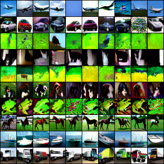
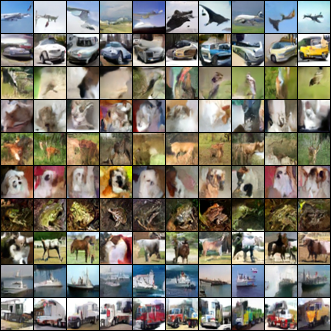

# Results and discussion

## Disclaimer(s)
- Models are not currently trained and evaluated on the same train and validation sets due to `random_split`. However, FIDs are computed on same train and validation sets. Therefore, one shouldn't give conclusions based on them (where we write a "*").
- However, the tests sets are the same across models.
- Each FID score reported below is computed between 50k generated images (from the last epoch) and a reference set: either train, val or test sets.
- Generated images are compared to transformed/pre-processed reference images.

## Quantitative FID results

### FashionMNIST
- **Class-conditional FID:**

    |                    | Train*  | Val*    | Test        |
    |--------------------|---------|---------|-------------|
    | w/ self-attention  | 9.1676  | 10.5069 | **10.2580** |
    | w/o self-attention | 13.9130 | 15.0970 | 14.7425|

- **Unconditional FID:**

    |                    | Train*  | Val*    | Test        |
    |--------------------|---------|---------|-------------|
    | w/ self-attention  | 19.1392  | 20.1931 | 19.5964 |

### CIFAR-10
- **Class-conditional FID:**

    |                    | Train*  | Val*    | Test        |
    |--------------------|---------|---------|-------------|
    | w/ self-attention  | 20.4102  | 22.4736 | **22.5495** |
    | w/o self-attention | 22.7896 | 24.7956 | 24.3233|

- **Unconditional FID:**

    |                    | Train*  | Val*    | Test        |
    |--------------------|---------|---------|-------------|
    | w/ self-attention  | 28.5462  | 30.6864 | 30.6589 |

### CelebA (Work In Progress)

- **Unconditional FID:**

    |                    | Train*  | Val*    | Test        |
    |--------------------|---------|---------|-------------|
    | big  |   |  |  |
    | small  |   |  |  |
    | tiny  |   |  |  |
    | tiny w/o self-attention |   |  |  |

## Discussion

### Effect of Classifier-Free Guidance

In the following, we **qualitatively** discuss the behavior of Classifier-Free Guidance (CFG) on CIFAR-10 with $50$ Euler method steps. We omit FashionMNIST since CFG barely affects its generated samples.

|  |  |  |  |
|:--:|:--:| :--:| :--:|
|  |  |  |  |
| *cfg.scale=1* | *cfg.scale=2.5* | *cfg.scale=5* | *cfg.scale=7* |

- The CFG scale $\alpha$ deforms the distribution and reduces diversity but can help "separate" classes. One should only tweak that scale if one doesn't want to exactly sample for the class-conditional distribution!
- As we can see from the generated CIFAR-10 pictures, a high CFG scale can cause saturated colors while a low CFG scale can lead to visually poor samples. Therefore, one may opt for class and dataset dependent scales.

#### Remarks
- Our **Classifier-Free Guidance** (CFG) scale $\alpha$ corresponds to using $\nabla_x \log p_{t, \alpha}(x|c) = (1-\alpha) \nabla_x \log p_t(x) + \alpha \nabla_x \log p_t(x|c)$ instead of the unconditional score function $\nabla_x \log p_t(x)$ of noisy marginal distributions in the original probability flow ODE $dx = -\dot{\sigma}(t) \sigma(t) \nabla_x \log p_t(x)dt$.
- [Classifier-Free Diffusion Guidance](https://arxiv.org/abs/2207.12598) paper uses, assuming we can directly replace a noise by a score function, $\nabla_x \log p_{t, \alpha}(x|c) = -\omega \nabla_x \log p_t(x) + (1+\omega) \nabla_x \log p_t(x|c)$ with $\omega=\alpha-1 > 0$. Therefore our CFG scale $\alpha$ should be greater than $1$.
- $\nabla_x \log p_{t, \alpha}(x|c)$ can also be rewritten as $\nabla_x \log p_t(x) + \alpha (\nabla_x \log p_t(x|c) - \nabla_x \log p_t(x))$
- Our CFG scale is not adaptive in our sampling methods.

### Effect of self-attention

#### Class-conditional FashionMNIST and CIFAR-10
In the following, we **qualitatively** and **quantitatively** discuss the effect of self-attention on class-conditional FashionMNIST and CIFAR-10 with cfg scale 1 and 2.5 respectively (both with $50$ Euler method steps). Note that the self-attention ablation also reduces the number of parameters and therefore also reduces the model capacity.

---

- Rows: with/without self-attention at each resolution level
- Columns: FashionMNIST, CIFAR-10

|w/|  |   |
|:--:|:--:| :--:|
|w/o|  |  |
|| *cfg.scale=1* | *cfg.scale=2.5* |

- Removing self-attention visually doesn't seem to strongly affect FashionMNIST and CIFAR-10.
- **Hypothesis:** big enough receptive field (far-away dependencies are catched), convolution does the heavy lifting. The slight differences could be caused by the difference in the model capacity and number of parameters.

- **Class-conditional FashionMNIST FID:**

    |                    | Train*  | Val*    | Test        |
    |--------------------|---------|---------|-------------|
    | w/ self-attention  | 9.1676  | 10.5069 | **10.2580** |
    | w/o self-attention | 13.9130 | 15.0970 | 14.7425|

    By only looking at the FID test, we can observe that self-attention matters (or at least the higher model capacity)
- **Class-conditional CIFAR-10 FID:**

    |                    | Train*  | Val*    | Test        |
    |--------------------|---------|---------|-------------|
    | w/ self-attention  | 20.4102  | 22.4736 | **22.5495** |
    | w/o self-attention | 22.7896 | 24.7956 | 24.3233|

    By only looking at the FID test, we can observe that self-attention matters (or at least the higher model capacity)

- **Loss:**

<!-- ### Unconditional CelebA

- Removing self-attention visually doesn't seem to strongly affect CelebA.
- **Hypothesis:** big enough receptive field (far-away dependencies are catched), convolution does the heavy lifting. The differences could be caused by the difference in the model capacity and number of parameters.
- **FID:**
- **Loss:** -->

#### Sampling in a convolutional manner CIFAR-10 and FashionMNIST

- First row: with self-attention at each resolution level
- Second row: without self-attention

|  |   |
|:--:| :--:|
|  |  |
| *cfg.scale=1* | *cfg.scale=2.5* |

## Practical "lessons"

- Bigger network for more capacity. Going from 2M to 33M parameters (or more): randomly positioned eyes (and more than $2$) to recognizable faces (probably thanks to the Multi-head self-attention layers and bigger receptive fields!)
- Trade-off between model architecture and batch size for higher resolution images due to VRAM limits.
- We have to place the Multi-head self-attention layers in lower spatial resolution due to the quadratic complexity in attention. A spatial resolution $32^2=32 \times 32$ or $16^2 = 16 \times 16$ is intuitively enough to capture the long-range contextual information/dependencies and costs way less than a spatial resolution of $128^2$. On the other hand convolution layers, at both high and low spatial resolution, fix "local" inconsistencies (up to the receptive field size).
- Ablation of Multi-head self-attention only slightly affect the visual quality probably due to big enough receptive fields.